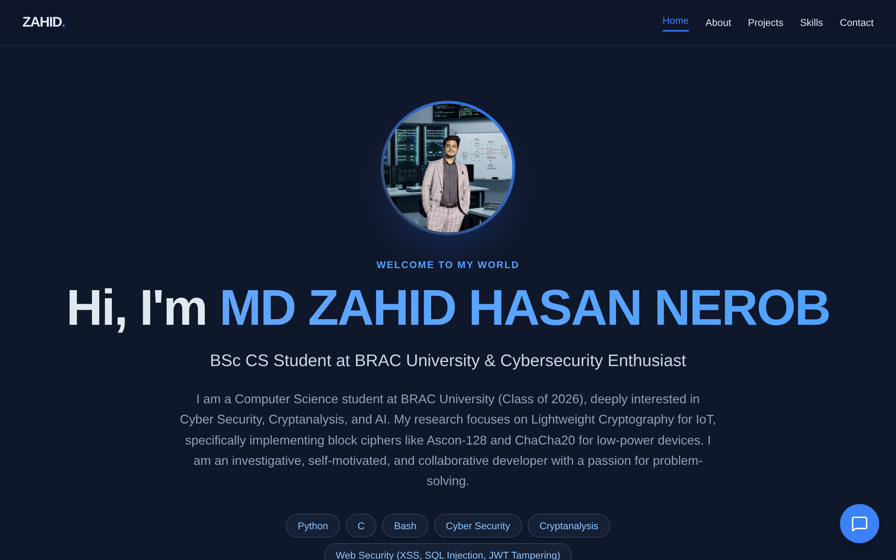
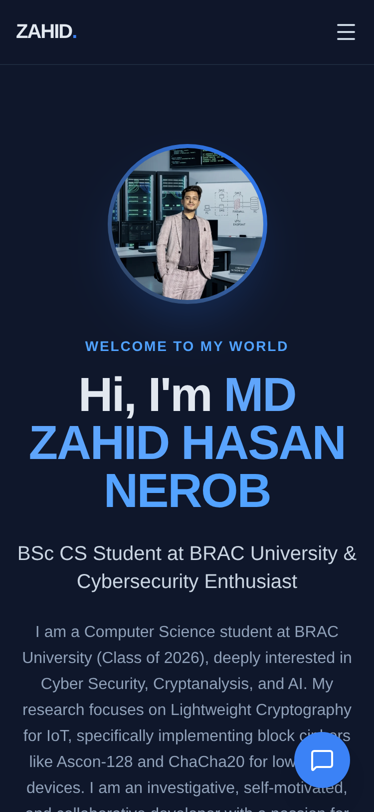

# Project Report: Full-Stack AI-Powered Personal Portfolio

**Author:** MD Zahid Hasan Nerob  
**Role:** BSc CS Student at BRAC University & Cybersecurity Enthusiast  
**Live URL:** [https://ai-portfolio-klrz.onrender.com/](https://ai-portfolio-klrz.onrender.com/)  
**Date:** May 2026

---

## 1. Abstract
The "AI-Powered Personal Portfolio" is a modern, full-stack web application designed to showcase professional skills, projects, and educational background while providing an interactive and secure experience for visitors. Moving beyond a static website, this project integrates a context-aware AI chatbot, a persistent local database for contact inquiries, and robust cybersecurity measures, reflecting the developer's expertise in both software engineering and web security.

## 2. Objectives
*   **Dynamic Presentation:** Create a visually striking, responsive portfolio that highlights technical skills and featured projects.
*   **Interactive AI Integration:** Implement an autonomous AI assistant capable of answering visitor queries based on the developer's resume and configuration data.
*   **Secure Communication:** Build a reliable contact form backed by a database and email notifications, protected against spam and common web vulnerabilities.
*   **Maintainability:** Centralize all portfolio content into a single JSON configuration file to allow for instant updates without modifying the source code.

## 3. Technology Stack

### Frontend (Client-Side)
*   **Framework:** React (via Vite)
*   **Styling:** Tailwind CSS v4 (Utility-first CSS)
*   **Animations:** Framer Motion
*   **Icons:** Lucide React

### Backend (Server-Side)
*   **Runtime:** Node.js
*   **Framework:** Express.js
*   **Database:** SQLite3 (`better-sqlite3`) for persistent local storage
*   **Email Delivery:** Resend API (HTTP-based email delivery)
*   **AI Integration:** Groq SDK (utilizing `llama-3.1-8b-instant` model)

## 4. System Architecture & Key Features

### 4.1 Centralized Configuration (`owner.config.json`)
The entire application is driven by a single configuration file. Both the React frontend (for rendering text, skills, and projects) and the Groq AI backend (for context injection) parse this file. This ensures the AI always has the most up-to-date information about the developer.

### 4.2 Context-Aware AI Chatbot
A floating chat widget is available on all pages. When a user asks a question, the backend constructs a prompt containing the user's message history alongside the `owner.config.json` data. The Groq API processes this and returns a natural, conversational response acting on behalf of the developer.

### 4.3 Secure Contact & Admin System
*   **Dual Delivery:** When a user submits the contact form, the inquiry is securely saved into a local SQLite database (`contacts.db`) and simultaneously emailed to the developer via the Resend HTTP API.
*   **Admin Dashboard:** A password-protected endpoint (`/api/messages?key=...`) generates a server-side HTML view, allowing the developer to review all stored messages directly from the browser.

### 4.4 Responsive & Aesthetic UI
The frontend utilizes a dark-mode glassmorphic aesthetic with a custom radial gradient background. It features a responsive navigation bar that adapts into a mobile-friendly hamburger menu (`lucide-react` icons) on smaller screens.

## 5. Security Implementations
Given the author's focus on cybersecurity, the backend is fortified with industry-standard protections:
1.  **Helmet.js (HTTP Headers):** Mitigates Cross-Site Scripting (XSS), Clickjacking, and MIME-sniffing attacks by enforcing strict HTTP response headers.
2.  **Express Rate Limiting (DDoS & Spam Protection):** 
    *   **Global Limit:** Maximum 100 requests per 15 minutes per IP.
    *   **Chat Limit:** Maximum 30 AI queries per 5 minutes to prevent API quota exhaustion.
    *   **Contact Limit:** Maximum 5 emails per hour to prevent SMTP/Resend spam.
3.  **SQL Injection (SQLi) Prevention:** All database transactions use strictly parameterized queries (`Prepared Statements`) via `better-sqlite3`, making SQL injection mathematically impossible.
4.  **Environment Variables:** Sensitive data (API keys, admin passwords) are strictly managed via `.env` files and injected securely into the production environment.

## 6. Deployment Strategy
The application is deployed as a unified Web Service on **Render**. 
*   A custom root `package.json` script (`npm run build`) sequentially installs frontend dependencies, builds the React production bundle, and installs backend dependencies.
*   The Express backend serves both the `/api` routes and the static compiled frontend from the `/dist` folder.
*   Environment variables are securely injected via the Render Dashboard.

## 7. Screenshots

### Desktop View

### Mobile View

## 8. Conclusion
This project successfully bridges the gap between front-end aesthetics, back-end reliability, and artificial intelligence. By integrating a custom LLM assistant and applying stringent cybersecurity principles, the portfolio serves not only as a digital resume but as a practical, live demonstration of full-stack engineering capabilities.
